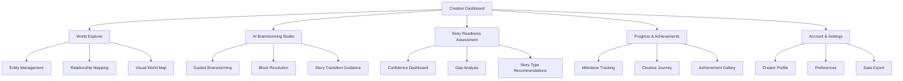
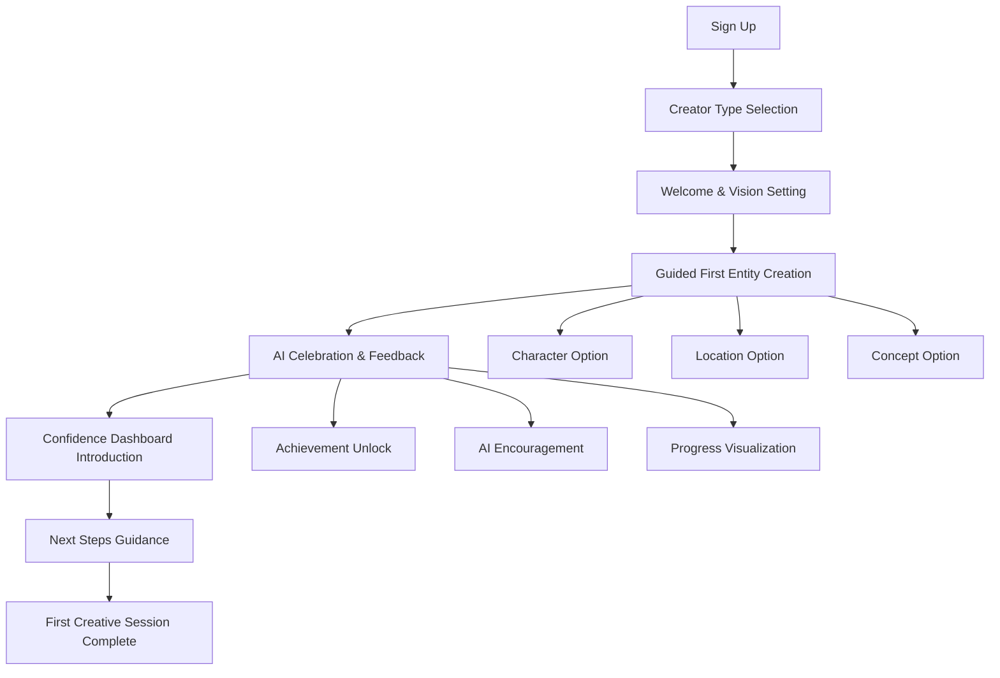
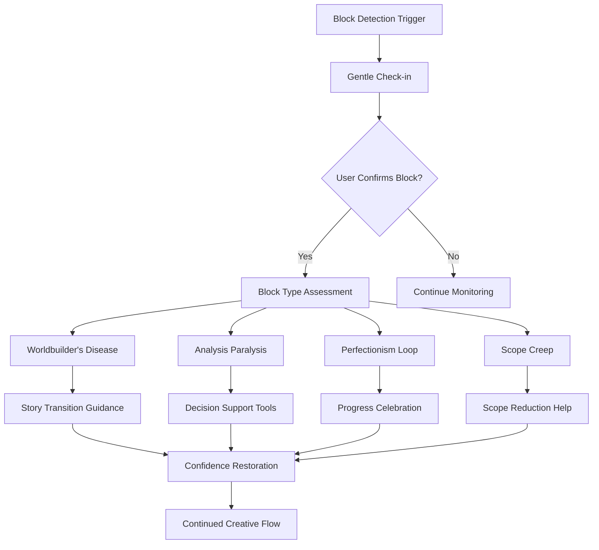
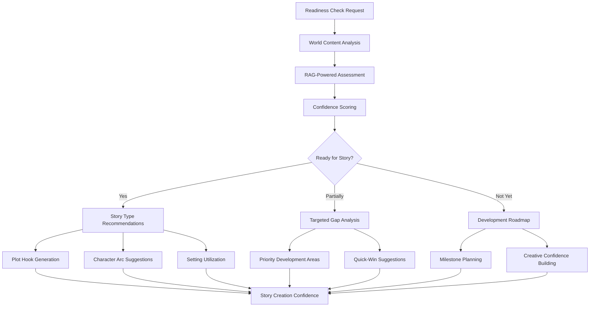

# AI Worldbuilding Assistant UI/UX Specification

## Introduction

This document defines the user experience goals, information architecture, user flows, and visual design specifications for the AI Worldbuilding Assistant's user interface. It serves as the foundation for visual design and frontend development, ensuring a cohesive and confidence-building user experience that addresses the core creative paralysis problem affecting 42% of worldbuilders.

### Overall UX Goals & Principles

#### Target User Personas

**Indie Authors (Primary)**
- Need creative confidence and writing transition support
- Budget: $10-30/month
- Pain points: Worldbuilder's disease, perfectionism loops
- Success: Publishing completed stories with rich worldbuilding

**Game Developers (Secondary)**
- Need scope management and technical constraint integration
- Budget: $20-50/month
- Pain points: Scope creep paralysis, complex system management
- Success: Shipping games with coherent world design

**RPG Creators & Dungeon Masters (Secondary)**
- Need efficient preparation with creative confidence
- Budget: $15-40/month
- Pain points: Over-preparation, analysis paralysis
- Success: Running engaging campaigns with rich, consistent worlds

#### Usability Goals

- **Confidence Building**: Users feel "story-ready" within 30 days of use
- **Block Prevention**: 70% reduction in creative paralysis incidents through proactive intervention
- **Transition Success**: Increase worldbuilding-to-writing transition rate from 33% to 60%
- **Creative Flow**: Maintain uninterrupted creative sessions with <2 second AI response times
- **Tool Consolidation**: Replace 3+ existing tools with single integrated platform

#### Design Principles

1. **Confidence Over Perfection** - Emphasize progress and story-readiness over exhaustive completion
2. **Gentle Guidance Over Prescription** - Suggest and inspire rather than dictate creative choices
3. **Progressive Revelation** - Show complexity gradually as users become more comfortable
4. **Relationship-Centric** - Always highlight connections and opportunities in worldbuilding
5. **Celebration-Driven** - Recognize achievements and creative momentum at every opportunity

### Change Log

| Date | Version | Description | Author |
|------|---------|-------------|--------|
| 2025-01-18 | 1.0 | Initial UI/UX specification | UX Expert |

## Information Architecture (IA)

### Site Map / Screen Inventory

### Navigation Structure

**Primary Navigation:**
- Persistent sidebar with AI assistant always accessible
- Main navigation tabs for core workflows (Dashboard, Explorer, Brainstorming, Assessment)
- Quick actions toolbar for common tasks (Add Character, Ask AI, Check Readiness)

**Secondary Navigation:**
- Contextual panels that slide in for detailed editing
- Breadcrumb trails for deep content hierarchy
- Smart shortcuts based on current creative context

**Breadcrumb Strategy:**
- Context-aware breadcrumbs showing creative journey path
- "Back to creative flow" quick return from any deep navigation
- Visual progress indicators showing session accomplishments

## User Flows

### Flow 1: New User Onboarding & Confidence Building

**User Goal:** Successfully create first world content and feel confident about the creative process

**Entry Points:** Landing page sign-up, trial activation, creator type selection

**Success Criteria:** User completes first world entity, receives positive AI feedback, understands core confidence-building features

#### Flow Diagram

#### Edge Cases & Error Handling:
- User overwhelm during onboarding → Simplified "quick start" path
- Empty content creation → AI prompting and template suggestions
- Creator type uncertainty → "Discover as you go" option with adaptive interface
- Technical issues → Graceful offline mode with content sync when reconnected

**Notes:** Onboarding emphasizes creative potential over technical features, with immediate positive reinforcement

### Flow 2: Creative Block Detection & Resolution

**User Goal:** Overcome creative paralysis and maintain productive worldbuilding momentum

**Entry Points:** AI detection of block patterns, user self-reporting feeling stuck, prolonged editing without progress

**Success Criteria:** User regains creative confidence, makes meaningful progress, understands prevention strategies

#### Flow Diagram

#### Edge Cases & Error Handling:
- False positive block detection → Gentle dismissal option with learning
- User rejects all suggestions → Alternative creative approaches and break recommendations
- Severe creative anxiety → Professional support resources and community connection
- Multiple simultaneous blocks → Prioritized intervention starting with most blocking issue

**Notes:** All interventions are optional and framed as supportive suggestions rather than required actions

### Flow 3: Story Readiness Assessment & Transition

**User Goal:** Confidently transition from worldbuilding to story creation with clear understanding of readiness

**Entry Points:** User requests readiness check, AI detects sufficient content depth, milestone achievement triggers

**Success Criteria:** User feels confident about story potential, has clear next steps, maintains creative momentum through transition

#### Flow Diagram

#### Edge Cases & Error Handling:
- Insufficient content for assessment → Gentle guidance toward minimum viable world
- Conflicting readiness signals → Multiple story type options with explanations
- User disagrees with assessment → Customizable criteria and manual override options
- Analysis overwhelm → Simplified "ready/not ready" with optional detail expansion

**Notes:** Assessment focuses on creative potential rather than exhaustive completion requirements

## Wireframes & Mockups

### Primary Design Files
**Design Tool Integration:** Figma workspace for collaborative design iteration and developer handoff

### Key Screen Layouts

#### Creative Dashboard
**Purpose:** Central hub for all worldbuilding activities with confidence-building focus

**Key Elements:**
- AI Assistant conversation panel (always visible, collapsible)
- Current world quick overview with relationship highlights
- Confidence meter with progress visualization
- Recent activity feed with celebration moments
- Quick action buttons for common creative tasks
- Today's creative goals and milestone progress

**Interaction Notes:** Dashboard adapts based on creator type and current creative phase
**Design File Reference:** [Figma Frame: Dashboard-Main]

#### AI Brainstorming Studio
**Purpose:** Dedicated space for AI-assisted creative problem solving and block resolution

**Key Elements:**
- Large conversation area with contextual AI personality
- World context sidebar showing relevant entities
- Creative prompt library with personalized suggestions
- Block resolution tools and confidence-building exercises
- Session notes and insight capture
- Progress tracking and next steps guidance

**Interaction Notes:** Full-screen focus mode available for deep creative sessions
**Design File Reference:** [Figma Frame: Brainstorming-Studio]

#### World Explorer with Relationship Mapping
**Purpose:** Visual navigation of world content with AI-discovered relationship insights

**Key Elements:**
- Interactive relationship graph with zoom and filter controls
- Entity detail panels with quick editing capabilities
- Relationship strength indicators and connection discovery
- Search and filter tools with AI-powered suggestions
- Content creation shortcuts from relationship insights
- Visual clustering by themes, conflicts, and story potential

**Interaction Notes:** Touch-friendly for tablet use, keyboard shortcuts for power users
**Design File Reference:** [Figma Frame: World-Explorer]

#### Story Readiness Assessment
**Purpose:** Confidence dashboard showing world completion and story preparation status

**Key Elements:**
- Overall confidence score with visual progress ring
- Story type readiness matrix with specific recommendations
- Gap analysis with prioritized development suggestions
- Character arc potential indicators
- Plot hook discovery based on world tensions
- Transition guidance with next steps

**Interaction Notes:** Expandable detail sections for each assessment area
**Design File Reference:** [Figma Frame: Readiness-Assessment]

## Component Library / Design System

### Design System Approach
**AI Worldbuilding Assistant Design System (AWADS):** Custom design system optimized for creative confidence building with warm, inspiring aesthetics and progressive complexity revelation.

### Core Components

#### AI Assistant Chat Interface
**Purpose:** Natural conversation with AI that feels supportive and encouraging
**Variants:** Compact sidebar, expanded studio mode, mobile conversation
**States:** Listening, thinking, responding, celebrating, concerned
**Usage Guidelines:** Always maintain encouraging tone, provide escape options, celebrate user input

#### Confidence Meter
**Purpose:** Visual representation of creative progress and story-readiness
**Variants:** Ring progress, linear bar, milestone journey
**States:** Building, confident, story-ready, transitioning
**Usage Guidelines:** Focus on progress rather than completion, always show next achievable milestone

#### Relationship Graph
**Purpose:** Interactive visualization of world entity connections
**Variants:** Full map, focused view, mobile simplified
**States:** Overview, detailed, editing, discovery mode
**Usage Guidelines:** Highlight opportunities rather than overwhelming with complexity

#### Creative Block Intervention
**Purpose:** Gentle intervention when creative blocks are detected
**Variants:** Subtle notification, conversation starter, guided resolution
**States:** Detection, assessment, intervention, resolution, prevention
**Usage Guidelines:** Always optional, framed as support rather than criticism

#### Achievement Celebration
**Purpose:** Recognition of creative milestones and progress
**Variants:** Subtle notification, full-screen celebration, progress badge
**States:** Earned, acknowledged, displayed, shared
**Usage Guidelines:** Immediate recognition, specific achievement details, encourage continuation

## Branding & Style Guide

### Visual Identity
**Brand Approach:** Inspiring creativity and confidence through warm, encouraging design language that feels like a supportive creative mentor

### Color Palette

| Color Type | Hex Code | Usage |
|------------|----------|-------|
| Primary | #7C3AED | AI assistant, confidence indicators, primary actions |
| Secondary | #059669 | Progress, achievements, positive feedback |
| Accent | #DC2626 | Gentle warnings, important alerts, creative urgency |
| Success | #10B981 | Milestone celebrations, story-readiness, achievements |
| Warning | #F59E0B | Creative blocks, attention needed, gentle interventions |
| Error | #EF4444 | Technical issues, critical problems, data loss prevention |
| Neutral | #374151, #6B7280, #9CA3AF, #D1D5DB, #F3F4F6 | Text hierarchy, backgrounds, structural elements |

### Typography

#### Font Families
- **Primary:** Inter (clean, readable for interface elements)
- **Secondary:** Crimson Text (literary feel for content areas)
- **Monospace:** JetBrains Mono (code and technical details)

#### Type Scale

| Element | Size | Weight | Line Height |
|---------|------|--------|-------------|
| H1 | 2.25rem | 700 | 1.2 |
| H2 | 1.875rem | 600 | 1.3 |
| H3 | 1.5rem | 600 | 1.4 |
| Body | 1rem | 400 | 1.6 |
| Small | 0.875rem | 400 | 1.5 |

### Iconography
**Icon Library:** Heroicons with custom creative-focused additions for worldbuilding concepts
**Usage Guidelines:** Consistent stroke width, optimized for clarity at small sizes, meaningful metaphors for creative concepts

### Spacing & Layout
**Grid System:** 12-column responsive grid with 24px base spacing unit
**Spacing Scale:** 4px, 8px, 12px, 16px, 24px, 32px, 48px, 64px, 96px, 128px

## Accessibility Requirements

### Compliance Target
**Standard:** WCAG 2.1 AA compliance with progressive enhancement for AAA where feasible

### Key Requirements

**Visual:**
- Color contrast ratios: 4.5:1 minimum for normal text, 3:1 for large text
- Focus indicators: Clear 2px outline with high contrast on all interactive elements
- Text sizing: Scalable up to 200% without horizontal scrolling

**Interaction:**
- Keyboard navigation: All functionality accessible via keyboard with logical tab order
- Screen reader support: Comprehensive ARIA labels, headings hierarchy, and semantic markup
- Touch targets: Minimum 44px for mobile interactions with adequate spacing

**Content:**
- Alternative text: Descriptive alt text for all images and visual content
- Heading structure: Logical H1-H6 hierarchy for content organization
- Form labels: Clear, descriptive labels for all form inputs and controls

### Testing Strategy
Automated accessibility testing integrated into development workflow with manual testing using screen readers and keyboard-only navigation

## Responsiveness Strategy

### Breakpoints

| Breakpoint | Min Width | Max Width | Target Devices |
|------------|-----------|-----------|----------------|
| Mobile | 320px | 767px | Phones, small tablets |
| Tablet | 768px | 1023px | Tablets, small laptops |
| Desktop | 1024px | 1439px | Laptops, small monitors |
| Wide | 1440px | - | Large monitors, ultra-wide displays |

### Adaptation Patterns

**Layout Changes:**
- Mobile: Single column layout with collapsible panels and bottom navigation
- Tablet: Two-column layout with side panels and touch-optimized controls
- Desktop: Multi-panel layout with persistent navigation and detailed views
- Wide: Extended content areas with additional context panels

**Navigation Changes:**
- Mobile: Bottom tab bar with hamburger menu for secondary options
- Tablet: Side navigation with collapsible sections and gesture support
- Desktop: Persistent sidebar with expanded menu options and shortcuts
- Wide: Extended navigation with quick access to all major features

**Content Priority:**
- Mobile: AI assistant and current task focus with minimal chrome
- Tablet: Balanced view of assistant and content with easy switching
- Desktop: Full feature access with multiple simultaneous views
- Wide: Maximum context visibility with advanced power user features

**Interaction Changes:**
- Mobile: Touch-first design with large tap targets and swipe gestures
- Tablet: Mixed touch and pointer with context menus and drag-drop
- Desktop: Keyboard shortcuts and mouse precision for detailed editing
- Wide: Advanced keyboard navigation and multi-monitor workspace support

## Animation & Micro-interactions

### Motion Principles
**Purposeful Animation:** Every animation serves to guide attention, provide feedback, or enhance understanding of relationships and progress

### Key Animations

- **Confidence Meter Fill:** Smooth progress animation celebrating achievement milestones (Duration: 800ms, Easing: ease-out)
- **AI Response Appearance:** Gentle fade-in with typing indicators for natural conversation feel (Duration: 200ms, Easing: ease-in-out)
- **Relationship Discovery:** Highlight and connect animations when AI discovers new connections (Duration: 600ms, Easing: cubic-bezier)
- **Block Intervention:** Subtle attention-getting animation without disrupting creative flow (Duration: 400ms, Easing: ease-in-out)
- **Achievement Celebration:** Satisfying celebration animation for milestone completion (Duration: 1200ms, Easing: bounce)
- **Content Creation:** Smooth insertion animations for new world entities (Duration: 300ms, Easing: ease-out)
- **Transition Guidance:** Gentle pulsing to indicate story-ready status (Duration: 2000ms, Easing: ease-in-out)

## Performance Considerations

### Performance Goals
- **Page Load:** Under 2 seconds for initial interface load
- **AI Interaction Response:** Under 2 seconds for confidence and creative flow
- **Animation FPS:** Smooth 60fps for all UI animations and interactions

### Design Strategies
**Progressive Loading:** Critical UI elements load first with AI features enhancing progressively
**Optimized Assets:** Vector icons, optimized images, and lazy loading for non-critical visual elements
**Efficient Animations:** CSS transforms and GPU acceleration for smooth performance across devices

## Next Steps

### Immediate Actions
1. Create detailed Figma designs for core screens with component library
2. Develop interactive prototypes for AI conversation and relationship mapping
3. Conduct user testing sessions with target creator personas
4. Refine confidence-building interaction patterns based on feedback
5. Create development-ready design system documentation

### Design Handoff Checklist
- [x] All user flows documented with edge cases
- [x] Component inventory complete with states and variants
- [x] Accessibility requirements defined with testing approach
- [x] Responsive strategy clear with breakpoint behaviors
- [x] Brand guidelines incorporated with creative focus
- [x] Performance goals established with design constraints